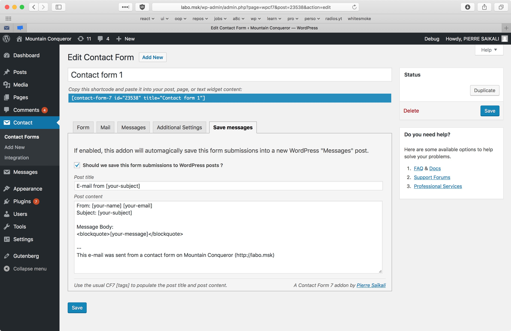
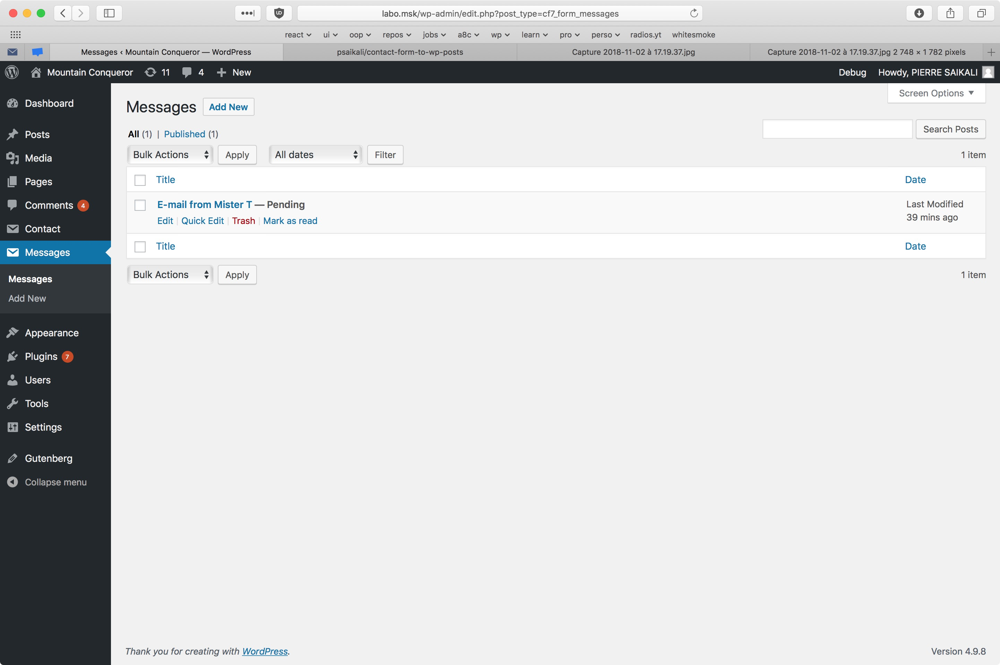

# Contact Form 7 To WordPress Post

> Extend Contact Form 7 and save form entries into WordPress posts. 

## Description
**This plugin is a Contact Form 7 addon.**

It lets you save each CF7 form submissions into a WordPress "Messages" post.
Never lose a message again! If your SMTP server is down, the message will still be stored in your WordPress database.

## Screenshots

## Installation
Installing "cf7-to-wp" can be done either by searching for "cf7-to-wp" via the "Plugins > Add New" screen in your WordPress dashboard, or by using the following steps:

1. Download the plugin via WordPress.org
1. Upload the ZIP file through the 'Plugins > Add New > Upload' screen in your WordPress dashboard
1. Activate the plugin through the 'Plugins' menu in WordPress